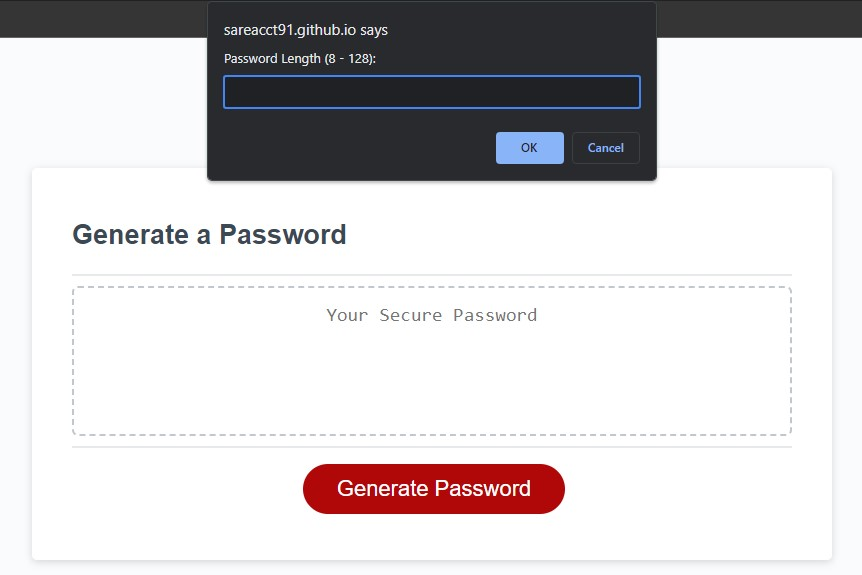
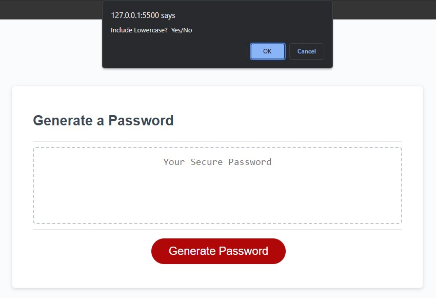
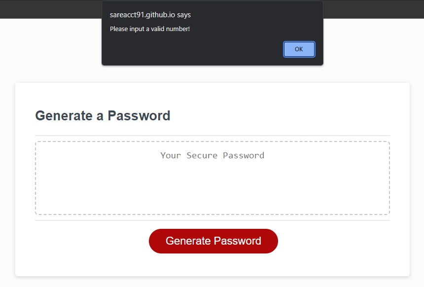
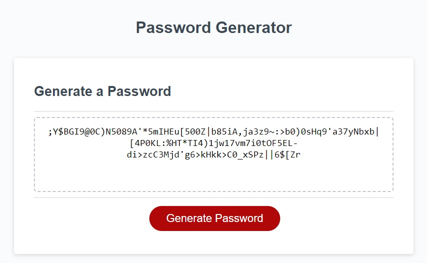

# Password-Generator

## Description

This application will generates a random password based on user preferences.

## Installation

No installation require.

https://sareacct91.github.io/Password-Generator/

## Usage

When you click on Generate Password a prompt will pop up asking for the password parameters.

The first prompt will ask for a number between 8 - 128.

The rest of the prompts will be a Yes or No question for the types of character that the password will contain.

    Lowercase
    Uppercase
    Numeric
    Special Character

If an invalid input was typed, then an alert will show up saying invalid input. The prompt will reappear and ask for the correct input.

If everything was input correctly, a random password based on the user preferenced will appear in the box.

## Features

Generate a random password based on user inputs

The perameters are:

    Lowercase characters
    Uppercase characters
    Numeric characters
    Special characters